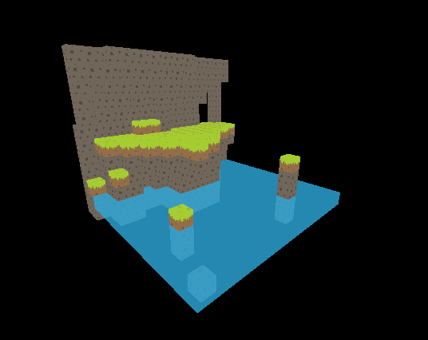

# Worlddisplay.js

### Intro
Please read into what "[worldeditor](https://github.com/Quoteme/worldeditor)" is, on it's own dedicated github project page.
This is the standalone optimized [worldeditor voxel map](https://github.com/Quoteme/worldeditor) viewer, that can be simpily included in a new three.js project.

to include a voxelmap, simply add these lines:

    

    // (... initiate three.js scene)
    // (... load a .json file that was saved from worldeditor into a variable)

    // create a new chunk (aka, a new object containing a voxel map)
        test = new Chunk();
    // set the file to the voxelfile we previously loaded
        test.file = exampleLevel;
    // generate a mesh with all the voxels in it (optimized)
        test.render();

and after all this, you should be greeted with a simple voxelmap in three.js :)

